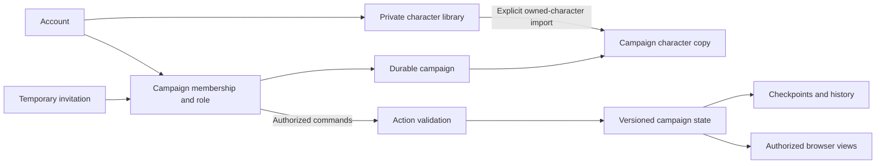

# SD Game: Security, Persistence, and Multiplayer Review

Date: September 14, 2026

## Recommendation

Keep Flask, SQLModel, and PostgreSQL. Build shared campaigns on the same account and ownership system used for saved runs and characters. Add reliable save revisions, revocable invitations, and authenticated game actions before expanding multiplayer.

Keep the requested six-character password minimum and support long passwords. The current local registration maximum is 1,024 characters. Stronger account protection can come from shared attempt limits, secure cookies, session revocation, and optional additional authentication. These controls reduce risk; they cannot make an easily guessed password equivalent to a strong one.

The first-version design below assumes players sign in, consistent with the current implementation. Guest participation can be added separately with a scoped guest identity; a display name or invitation code alone must never identify a returning player.

This is an assessment and implementation proposal. No application code was changed or deployed during this review.

## Scope and Evidence

- Reviewed `C:/SD_game/deployed_site_source`, commit `a110b3faf45f9e4af2cf99504c847ef9e3a642a3`, including the existing uncommitted security changes from this task.
- Read public responses from [the deployed game](https://ctreeder.com/site/), login, registration, and public JavaScript. These were read-only requests. No live accounts, saved games, or sessions were created or modified.
- The live `multiplayer.js` matches the local copy after normalizing line endings. Live `main.js` differs, but still contains the same host-only state upload, player-only hydration, and five-second polling behavior discussed below.
- The exact live backend commit, database privileges, backup jobs, and runtime environment were not accessible. Source findings are identified separately from confirmed live observations.
- Ran the existing auth, schema/login, run ownership, multiplayer, and run API suites: **45 passed**, with one Flask-Login deprecation warning. These tests do not establish that multiplayer gameplay works.
- Ran additional checks against an isolated in-memory database, including HTTPS login with CSRF tokens and production cookie configuration. Rate limiting was bypassed by test mode; its production behavior was not tested.

## Current Design

The repository describes nginx forwarding to Gunicorn/Flask, with PostgreSQL on a private Docker network. Browser JavaScript generates and runs the dungeon. Flask stores JSON snapshots and secondary relational copies of map objects.

Account protection already includes password hashing, Flask-Login, CSRF tokens on account forms, authenticated save APIs, ownership checks, and restricted multiplayer response fields. Normal registration currently collects **username and password, not email**. Email and a display name may be stored through GitHub OAuth. Saved content, password hashes, and account access still need protection even without payment information.

Saved runs and characters belong to individual users. Multiplayer has separate session and membership tables, eight-player and five-open-session limits, random 128-bit invite tokens, and host-only assignment/state replacement. A membership check protects session reads. Those are useful foundations.

The earlier assessment overstates two properties of the present implementation: remember-me cookies do not inherit the session cookie security settings, and the JSON APIs do not all consistently enforce JSON input. Documentation must follow observed behavior.

## Findings

Priorities below combine security exposure and the impact of losing or blocking a game. They are not claims of a demonstrated live breach.

### 1. High: Multiplayer does not yet support shared player actions

In [main.js](C:/SD_game/deployed_site_source/S3_content/src/main.js:8666), hosts upload their complete browser state and players only fetch it. [The state endpoint](C:/SD_game/deployed_site_source/app.py:1371) correctly rejects non-host writes. There are no movement, interaction, or action endpoints.

The local probe joined a second account successfully, then received `404` when that player submitted state. The client has no alternative action channel. Local player movement and edits therefore cannot become shared authoritative changes and can be replaced by the next host snapshot. This is the central functional blocker, not an invitation UI problem.

Add authenticated commands for each supported shared action. Check session membership and assigned character on the server. Do not solve this by allowing all players to upload complete snapshots.

### 2. High: A returning host can overwrite the shared dungeon

[Initialization](C:/SD_game/deployed_site_source/S3_content/src/main.js:9277) generates a new local dungeon before processing the invite link. [Session hydration](C:/SD_game/deployed_site_source/S3_content/src/main.js:8455) applies the stored dungeon only when the returned role is `player`. A returning host therefore keeps the newly generated local state, and the host polling loop can upload it over the existing session.

This data-loss path follows from code inspection; it was not executed against a live campaign. Fetch and hydrate the authoritative campaign for both roles before enabling input or writes. Resuming must be a separate path from creating a game. Revision checks must reject stale or unrelated state.

### 3. High operational risk: Database privileges and recovery are inadequate in the supplied deployment design

[Compose](C:/SD_game/deployed_site_source/docker-compose.yml:39) connects using the same `app` account initialized as the PostgreSQL administrative user, with a hard-coded password. The database has no published port, which is good, but an application compromise would have unnecessarily broad database access. Live credentials and privileges were not verified.

Use a distinct, restricted application role and a separate migration role. Move credentials to deployment secrets. Existing database passwords require explicit rotation; changing a container initialization variable does not rotate an already initialized database.

There is a manual backup command in the deployment guide, but no verified automated off-host backup/restore process in the reviewed code. Establish encrypted backups outside the instance, retention, failure alerts, and a restore drill. A persistent Docker volume is not a backup. Application save history and infrastructure backups serve different recovery needs.

### 4. Medium: Remember-me cookies lack transport protection

[Cookie configuration](C:/SD_game/deployed_site_source/app.py:69) hardens the Flask session but does not set the separate `REMEMBER_COOKIE_SECURE` and `REMEMBER_COOKIE_SAMESITE` settings.

The isolated production-mode login produced:

| Cookie | Secure | HttpOnly | Explicit SameSite |
| --- | --- | --- | --- |
| `session` | Yes | Yes | Lax |
| `remember_token` | No | Yes | Absent |

Set the remember cookie to `Secure`, `HttpOnly`, and `SameSite=Lax` in production, and test its actual response attributes. A redirect to HTTPS does not prevent an unprotected cookie being sent on an initial HTTP request. Browser default SameSite handling is not a substitute for explicit configuration. See [Flask-Login cookie settings](https://flask-login.readthedocs.io/en/latest/#cookie-settings).

Add a revocable login identifier or server-side session record so password changes, recovery, and "log out all devices" invalidate old logins, including remembered ones. Flask-Login documents [alternative identifiers](https://flask-login.readthedocs.io/en/latest/#alternative-tokens) for this purpose.

### 5. Medium, confirmed live: Previous header changes are not effective on the deployed pages

On September 14, [the game](https://ctreeder.com/site/), [login](https://ctreeder.com/login), and [registration](https://ctreeder.com/register) returned `200` without HSTS, CSP, X-Frame-Options, X-Content-Type-Options, Referrer-Policy, or Permissions-Policy. Responses advertised `nginx/1.24.0 (Ubuntu)`, unlike the repository's Docker nginx image.

This establishes a deployment/configuration mismatch, not the exact cause. Verify the active nginx configuration, application revision, and public responses after release. Exercise the game under CSP before rollout. Align Flask and nginx policies so duplicated headers do not create inconsistent behavior. Add `Cache-Control: no-store` on sensitive authenticated responses.

### 6. Medium: Saves have no protection against stale updates

[Run updates](C:/SD_game/deployed_site_source/app.py:945) and session updates replace state without checking a revision. A local probe saved `new`, then submitted an older `old` snapshot. Both requests returned `200`; the final stored value was `old`.

Add an integer revision and an atomic conditional update. Return a conflict when the submitted base revision is no longer current. Add bounded save history and restore/export features. Character saves currently support create/list/read only; add owner-checked update and delete, with recovery and pagination. The UI's list limits do not enforce storage quotas.

### 7. Medium: Session lifecycle and concurrency rules are incomplete

[Session creation](C:/SD_game/deployed_site_source/app.py:1249) counts all rows with `closed_at = NULL`. Expiration happens only through `_load_open_session`, so old untouched sessions still fill the quota. The probe confirmed that five two-day-old sessions prevent another host session. The error asks the user to close a session, but no close endpoint exists.

Add list/resume, close/archive, leave, kick, invitation rotation, and scheduled expiration. Expire invitation access independently of campaign storage. Enforce player capacity and assignment uniqueness transactionally: the current membership uniqueness constraint covers `(session_id, user_id)`, but not character ownership, and application-level check-then-insert operations can race across workers.

### 8. Medium: Abuse limits need shared state and appropriate keys

[Flask-Limiter](C:/SD_game/deployed_site_source/app.py:143) defaults to process memory, while Gunicorn uses multiple workers and recycles them. The package can also fail to import and silently disable application limits. [The library documents](https://flask-limiter.readthedocs.io/en/stable/configuration.html#ratelimit-storage-uri) that memory counters are per-process and disappear on restart.

Use Redis or another supported shared limiter store. Fail startup in production if required protection is missing. Combine IP, account, and operation limits. The nginx configuration currently shares one five-per-minute IP bucket across login, registration, hosting, and joining; a group behind the same home router can interfere with itself. Separate these budgets and return clear `429` responses with retry timing.

Also bound total saved bytes, saves per account, active campaigns, and expensive import concurrency. Measure real dungeon sizes: nginx currently has no explicit body limit here, so its default can reject a save below Flask's new 5 MiB limit. Align both limits and provide a useful error.

### 9. Medium: Input validation, CSRF, and proxy trust need consolidation

[Run creation](C:/SD_game/deployed_site_source/app.py:824) and [character creation](C:/SD_game/deployed_site_source/app.py:991) accept parsed JSON and call `.get()` without first requiring an object. Sending `[]` raised `AttributeError` in both local probes. Multiplayer checks the outer object but does not validate a complete dungeon schema or bound character IDs, nested collections, and map dimensions.

Introduce shared request schemas, a save schema version, controlled migrations for old saves, and collection/size limits. Respond with a structured `400`, not an exception. Keep display text rendered as text; the reviewed player-name UI uses `textContent` appropriately.

JSON mutations currently bypass CSRF tokens. SameSite and strict JSON requests reduce cross-site risk, but the optional-body join path and importer do not consistently require JSON; there is no uniform Origin check. This review did not demonstrate a cross-site browser exploit. Add a same-origin CSRF-token endpoint for the static client and send its token on mutations, including save deletion, plus Origin validation. Keep CORS closed. See [OWASP CSRF guidance](https://cheatsheetseries.owasp.org/cheatsheets/Cross-Site_Request_Forgery_Prevention_Cheat_Sheet.html).

ProxyFix trusts forwarded host/prefix headers that nginx does not explicitly overwrite. A local request with a fabricated forwarded host generated an invite URL at `untrusted.invalid`. Use a configured canonical public origin, reject unknown hosts, and overwrite or strip every trusted forwarding header at the proxy. A `server_name` declaration alone is not a host allowlist.

### 10. Additional account and game privacy improvements

- Add optional verified email recovery with expiring, single-use reset tokens, uniform responses, and attempt limits. For accounts without email, offer recovery codes and explain their role during account setup.
- Before expanding email registration, replace [automatic OAuth linking by matching email](C:/SD_game/deployed_site_source/app.py:570) with explicit authenticated linking or a rigorously verified linking policy. No takeover was demonstrated here.
- Keep usernames/display names separate from private account fields. Add account export/deletion and a clear backup retention policy.
- Do not write passwords, cookies, reset tokens, or invitation secrets to application or access logs. Existing invitation secrets are included in request paths and query strings.
- A session member currently receives the whole `state_json`, including unrevealed game content. That is acceptable only if hidden content is a presentation convention between trusted friends. For private GM notes or enforced fog of war, return an allowlisted player view and retain secrets on the server. Do not send a reconstructable secret map through a seed or complete snapshot.
- Require production-safe settings at startup, including rejection of test login and anonymous-import bypass modes. Isolate or queue the headless-browser importer if enabled.
- Existing CI triggers on pushes and pull requests despite stale comments. Add dependency/secret scanning and production-like HTTPS/PostgreSQL tests; do not infer deployment verification from SQLite unit tests.

## Comparison With Other Game Platforms

These are documented product behaviors and engineering patterns, not claims about vendors' private infrastructure or complete security posture.

| Platform | Documented approach | Useful adaptation for SD Game |
| --- | --- | --- |
| Roll20 | Shareable player invitations, separate creator/GM/player roles, removal that changes the join link. [Player management](https://help.roll20.net/hc/en-us/articles/29620515876375-Invite-Promote-and-Manage-Players). | Separate campaign membership from invitation secrets. Add host controls and revocation. Keep ordinary invite codes player-only. |
| Roll20 | Daily game snapshots with seven-day rollback history; the restore feature has subscription conditions. [Rollback](https://help.roll20.net/hc/en-us/articles/32139162477719-Rollback-Feature). | Add recovery from accidental edits and deletion, not just protection from outsiders. Retain useful checkpoints between infrastructure backups. |
| Foundry VTT | World-specific roles plus per-document ownership and permissions. [Users and permissions](https://foundryvtt.com/article/users/). | A campaign role and permission to control a character are different checks. Keep global SD accounts while scoping those permissions to each campaign. |
| Unity Cloud Save | Separate private/player-writable, public, and server-writable data classes. [Player data](https://docs.unity.com/en-us/cloud-save/concepts/player-data). | Treat account data, a personal character library, and shared campaign state as different ownership domains. |
| Unity Cloud Save | Write-lock tokens detect a save made against an outdated version. [Write locks](https://docs.unity.com/en-us/cloud-save/concepts/write-locks). | Require revisions when saving or executing shared actions. |
| Unity multiplayer | Authenticated joining by lobby ID or code. [Lobby join](https://docs.unity.com/en-us/services-cli/1.7.0/manual/lobby/commands/join). | A spoken code locates/adopts membership in a game; the authenticated account establishes who the player is. |

## Proposed Host and Join Experience

1. The host signs in, generates or loads a dungeon, and selects Host Game. Creation commits the campaign, host membership, and initial checkpoint together.
2. Show a short code such as `K7MT-4R9W`, a copyable invitation link, and connected players.
3. Friends enter the code or open the link. Preserve the intended game through login/registration using a validated local return destination.
4. After signing in, each friend joins as a player and selects one of their saved characters, or the host assigns a campaign character. Importing uses a server-verified owned character ID and creates a campaign copy with a new identity.
5. The server validates player actions and persists accepted changes. Every browser receives the resulting state revision. The host can assign characters, lock new joins, remove players, and regenerate invitations.
6. Everyone can find the campaign under My Games later. A disconnected host or expired invite does not erase the campaign. Existing membership allows return without reusing the invitation.

Suggested invitation parameters are design defaults, not properties of the current code: eight unambiguous base-32 characters (40 bits), case-insensitive entry, optional display hyphen, and a 30-minute validity period that the host can renew. Keep a separate high-entropy link token if desired. Generate codes cryptographically, enforce uniqueness with collision retries, and store a keyed digest. Short codes need shared per-account/IP attempt limits, capacity controls, and optional host approval. Do not simply truncate the present 128-bit token and use it forever.

After joining, use an ordinary session ID plus checked membership on API calls. Invitation expiry or rotation should block new joins, not revoke established friends. A kicked or banned member must lose access on the next read/action, and must not immediately rejoin using the same invitation. Redact invitation data from logs and remove it from the browser URL once exchanged.

## Backend Structure

Keep PostgreSQL as the durable source of truth. Redis can hold shared rate limits and short-lived presence and later distribute notifications; losing it must not erase saved games. A host is a campaign-level role, never a site/database administrator.

Extend the existing models rather than replacing all persistence at once:

| Data | Proposed responsibility |
| --- | --- |
| Campaign | Owner, name, lifecycle status, current revision, schema version, durable dungeon state. |
| Membership | Campaign/account pair, role, status, character assignment; checked on every relevant request. |
| Invitation | Campaign, digest, expiry, revocation, allowed role, optional use limit. |
| Campaign character | Copy imported from an owned saved character, controller membership, revision. Host edits do not silently overwrite the player's personal library. |
| Action receipt | Campaign, actor, request ID, accepted revision and result; makes retries idempotent. |
| Checkpoint | Bounded immutable snapshot, schema version, revision, time, actor/reason. |

An action such as `move` includes the character ID, destination, expected revision, and a unique request ID. In one transaction, verify identity, membership, ownership, current revision, allowed movement and game constraints; apply the change; persist its result; increment the revision. Reject incompatible stale actions with a conflict and recover the current view. Retry the same request ID without applying it twice. Use database constraints and row locks/conditional updates across workers, not an in-process lock.

Start with authoritative movement, doors, and shared exploration, followed by combat, inventory, loot, and timers. The current game rules live extensively in client JavaScript; moving their authority is substantive work. Extract deterministic rules and use parity fixtures as each behavior moves server-side. Avoid having independently evolving browser and server implementations decide different outcomes.

For a deliberately smaller interim release, a host can process a server-queued stream of player commands, while the backend enforces identity, membership, character assignment, payload limits, and sequencing. That remains a trusted-host design, requires the host browser to stay connected, and needs acknowledgements, replay protection, and checkpoints. It must not be represented as server-validated game rules or the completed durable multiplayer design.

Use revision-aware HTTP polling first for this small cooperative game. Return small changes or an unchanged result and send an action response immediately. Do not keep uploading/downloading the full dungeon on every presence refresh. Add WebSockets or SSE after the command model works; changing transport alone does not fix authorization or save conflicts. Streaming also requires suitable worker capacity, proxy settings, reconnect behavior, and authenticated subscriptions.

## Delivery Order and Acceptance

1. **Account and deployment foundation:** correct both cookie types; verify public headers; consolidate CSRF and request validation; shared rate limits; canonical host configuration; restricted DB role; backups and restore proof. Preserve the six-character password policy.
2. **Durable saves and campaigns:** migrations, revisions, checkpoints, personal-character update/delete, quotas and pagination, campaign ownership/membership, list/resume/close, and return-to-game after authentication.
3. **Working cooperative exploration:** readable invitation codes, owned-character import, atomic assignments, player commands for movement/doors/exploration, authoritative updates for both host and players, reconnect, kick/lock/rotate controls.
4. **Complete gameplay and operations:** shared combat/loot/timers, player-view filtering where required, host transfer or explicit pause behavior, recovery UI, optional guest identities/passkeys/MFA, metrics and dependency scanning. Adopt streaming only when measurements justify it.

The multiplayer acceptance gate should exercise two independent browser accounts on an HTTPS/PostgreSQL staging stack. Each player must move their assigned character and see the other's change; attempts to alter another character must fail. Refreshing the host must preserve the same dungeon. Reconnection and server restart must retain acknowledged progress. A stale save must conflict, duplicate commands must not execute twice, revoked players must lose access, expired codes must fail without deleting campaigns, and simultaneous joins must honor capacity/assignment constraints. Restore an earlier checkpoint and a database backup to prove recovery.

Existing passing tests cover useful access rules, but none of those results alone proves this complete workflow. The remaining release evidence should be a functioning two-browser campaign and a verified production configuration.
